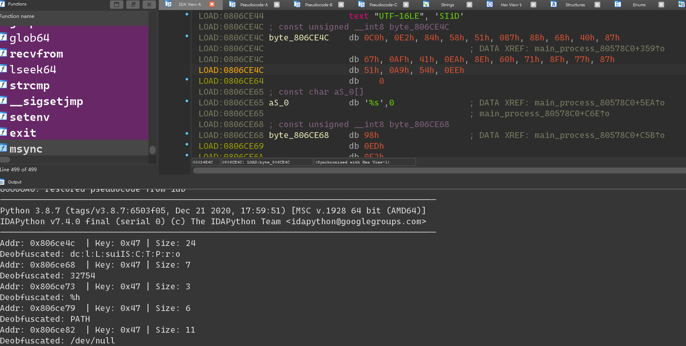

# EQGRP_Analysis
分析EQGRP的技巧

## 概述

现在全面分析方程式代码的条件成熟了，建立一个项目来分析其中的代码技巧。

## 工具

### Xor47 Deobfuscation

一个简单工具，用于反混淆字符串

#### 安装

目前支持python3, ida pro 7.7

将xor_plugin.py放到IDA的plugings目录下即可

#### 使用方法

如上图所示，在IDA View中，将光标放在需要解码的字符第一个字符所在的地址上，然后执行Edit->Plugins->Xor47 Deobfuscation，即可解码。

也可以使用Shift+D快捷键进行解码

### Xor Batch Deobfuscation

使用flare_emu对 noserver中的混淆字符串进行解码，一次就将可以解码的字符串全部解析完毕。

操作方法：在ida View中把光标放在解码函数开始，就可以在 Edit->Plugings->Xor Batch Deobfuscation

就会将所有的混淆字符进行解码，打印输出的控制台，并在代码中添加注释，显示解码后的字符串。

## C2平台

### NOPEN

### FuzzBunch

## 分析文章

1. cverc_20220314
2. Equation_NOPEN
3. Equation_FuzzBunch
4. 